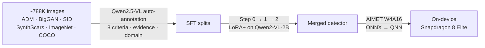

  🥈 2nd Place
  LPCVC 2026 · Track 3
  On-device · Snapdragon 8 Elite

ECV Workshop @ CVPR 2026, Denver &middot; Sponsored by Qualcomm

Can a phone tell a real photo from an AI-generated one — and <em>explain its reasoning</em>? Our entry to the 2026 IEEE Low-Power Computer Vision Challenge does both, <strong>fully on-device</strong>, under the contest's strict latency and power budgets.

  <a class="btn btn-sm btn-outline-dark me-1" href="https://github.com/LPCV-SSUPER-POWER/Track3-AI-Generated-Images-Detection" target="_blank" rel="noopener noreferrer"><i class="fa-brands fa-github me-1"></i> View code on GitHub</a>
  <a class="btn btn-sm btn-outline-dark" href="https://huggingface.co/Dayoung-space/SSUPER-AIGID" target="_blank" rel="noopener noreferrer">🤗 Model weights</a>

## The challenge



Track 3 raises the bar past a yes/no classifier: the model has to **decide *and* justify**.

> Saying "fake" isn't enough — the model has to point to **what** gives it away.

Every prediction therefore has two parts:

- **Detection** — is the image *Real* or *AI-Generated*?
- **Explanation** — a score and written evidence for each of **8 forensic criteria**:

  

<small>💡 Lighting &amp; Shadows</small>

  

<small>✂️ Edges &amp; Boundaries</small>

  

<small>🧵 Texture &amp; Resolution</small>

  

<small>📐 Perspective &amp; Space</small>

  

<small>⚖️ Physical / Common-Sense</small>

  

<small>🔤 Text &amp; Symbols</small>

  

<small>🧍 Human / Biological</small>

  

<small>🧱 Material &amp; Object Detail</small>

The organizers grade the submitted binary in **two stages**: first the model reads the image and writes a free-form analysis across the 8 criteria *(Stage 1)*, then it folds that analysis into one structured **JSON** — per-criterion score, evidence, and final verdict *(Stage 2)*.

### How it's scored

Two constraints drive every design decision:

  

    

      <h6 class="mb-1">⏱️ Speed gate</h6>
      
Inference must run <strong>faster than 15 tokens/s</strong> on the phone — miss it and the entry is disqualified.

    

  

  

    

      <h6 class="mb-1">🎯 Accuracy</h6>
      
A per-image score rewarding both the <strong>verdict</strong> and the <strong>explanation</strong>.

    

  

The accuracy score combines three measurements:

| Component | How it's measured |
| --- | --- |
| **Detection** | accuracy of the overall Real / AI-Generated call |
| **Criterion** | exact-match accuracy of each per-criterion judgment |
| **Evidence** | semantic similarity of the written evidence to ground truth |

$$
\text{Explanation} = 0.5\,(\text{Criterion}) + 0.5\,(\text{Evidence})
$$

$$
\text{Image score} =
\begin{cases}
\text{Detection} & \text{Real} \\[2pt]
0.5\,(\text{Detection}) + 0.5\,(\text{Explanation}) & \text{AI-Generated}
\end{cases}
\qquad
\text{Final} = \frac{\sum \text{Image score}}{\#\,\text{images}}
$$

## Approach

### 1 · Data & annotation

The hard part: almost none of the source images came with the 8-criteria labels the task needs.

- **Sources** — fakes from **GenImage (ADM, BigGAN)**, **SID-Set**, and **SynthScars**; real photos from **ImageNet** and **COCO**.
- **Auto-labeling** — **Qwen2.5-VL** annotates every image with a domain tag, text/person flags, and a 0–2 score + evidence per criterion.
- **Real images** get all-zero scores and a "no artifacts" note — turning a pile of unlabeled images into a fully supervised set.

### 2 · A 3-step training curriculum

A general VLM doesn't know what AI artifacts look like, so we taught **Qwen2-VL-2B** in stages with **LoRA+** *(LoRA, DoRA and PiSSA were also tried; the 7B model overfit, so 2B won)*:

- **Step 0 — learn to *analyze.*** Free-form "real or fake, and why" reasoning, so the model learns to *see* artifacts.
- **Step 1 — learn the *format.*** Compress that reasoning into the contest's compact template (~300 tokens) — token budget is part of the speed gate.
- **Step 2 — learn the *JSON.*** Emit valid structured output, with a consistency rule so any fake-criterion forces an `AI-Generated` verdict.

The trained adapter is then **merged** into the base model to give a single deployable network.

### 3 · Quantization & deployment

- Quantize the merged model with **AIMET (W4A16)** — both vision encoder and language model.
- Export through **ONNX → QNN binary** for the Snapdragon NPU.
- Match **calibration data** to the real inference distribution; a mismatch quietly wrecks quantized accuracy.

## Results

  

    
<h3 class="mb-0">2nd</h3><small class="text-muted">of all teams</small>

  

  

    
<h3 class="mb-0">0.72</h3><small class="text-muted">challenge score</small>

  

  

    
<h3 class="mb-0">31.2</h3><small class="text-muted">tokens/s · 2× the floor</small>

  

  

    
<h3 class="mb-0">2.6 GB</h3><small class="text-muted">QNN binary</small>

  



## Team

**Team SSUPER_POWER** — VIP Lab, Soongsil University:

- **Dayoung Kil**
- Doeon Kim
- Junyoon Lee

## Tech stack

  Qwen2.5-VL-7B
  Qwen2-VL-2B
  LoRA+ / DoRA / PiSSA
  PyTorch 2.10
  LLaMA-Factory 0.9.1
  AIMET Pro 1.34 (W4A16)
  QAIRT 2.31 · QNN

  Datasets: GenImage (ADM · BigGAN) · SID-Set · SynthScars · ImageNet · COCO · ARForensics. 
  <i class="fa-solid fa-scale-balanced me-1"></i> Code released under the MIT License.

